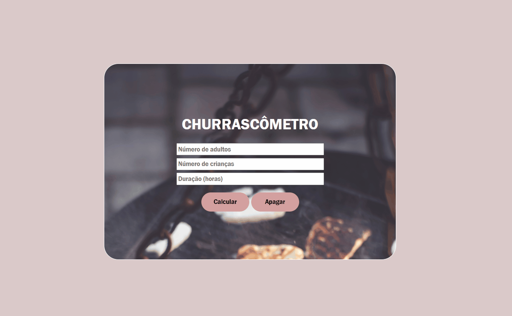

<h1 style="text-align: center">CHURRASCÔMETRO</h1>

Site que serve para ajudar as pessoas que querem realizar um churrasco, mas não fazem ideia de quantos quilogramas de carne, latas de cerveja e litros de refrigerante serão necessários.

## 📷 Demonstração
</img>

## 💻 Teste o Site
<a href="https://churrascometromeed.netlify.app/">Clique aqui para testar o site</a>

## Tecnologias

As seguintes ferramentes foram utilizadas na construção desse projeto:

- HTML
- CSS
- JavaScript

 
    Made by Matheus Medeiros da Silva
